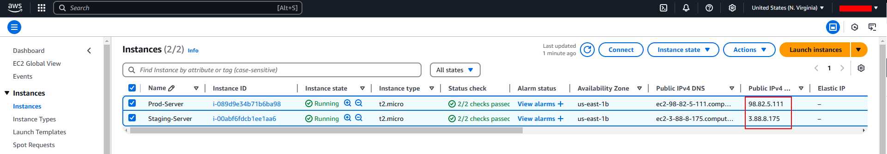

# Jenkins Pipeline for staticwebsite application

This project automates the CI/CD process for a Dockerized web application, leveraging Jenkins and deploying on AWS EC2 instances. The pipeline includes stages for building, testing, and deploying the application in both staging and production environments.

## Pipeline Workflow

1. **Build Image**: Build a Docker image from the provided `Dockerfile`.
2. **Run Container**: Launch a local container for testing the built image.
3. **Test Image**: Perform a basic acceptance test on the running container.
4. **Clean Container**: Remove the test container after validation.
5. **Push Image to Docker Hub**: Push the Docker image to Docker Hub (triggered only on the `master` branch).
6. **Deploy to Staging**: Deploy the Docker image on a staging AWS EC2 instance.
7. **Deploy to Production**: Deploy the Docker image on a production AWS EC2 instance (requires manual confirmation).

## Prerequisites

- Jenkins installed and configured with:
  - Plugins to be installed: docker, docker pipeline, docker-build-step, GitHub Integration Plugin, SSH Agent Plugin, Slack Notification Plugin.

  - A slack channel to be configured:

  - A shared library (`shared-library`) for reusable functions.

  - Credentials for DockerHub password, Slack access key and aws private key.

- AWS EC2 instances for staging and production with Docker installed.

